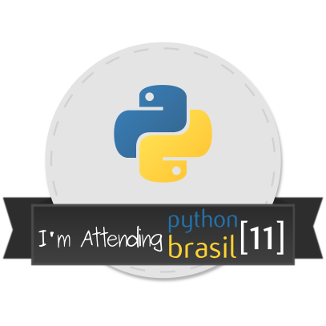
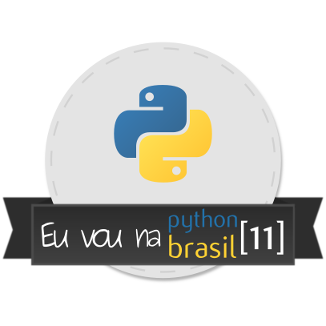
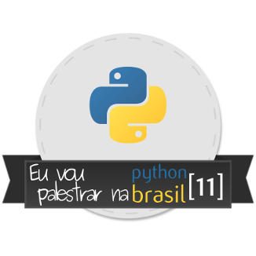
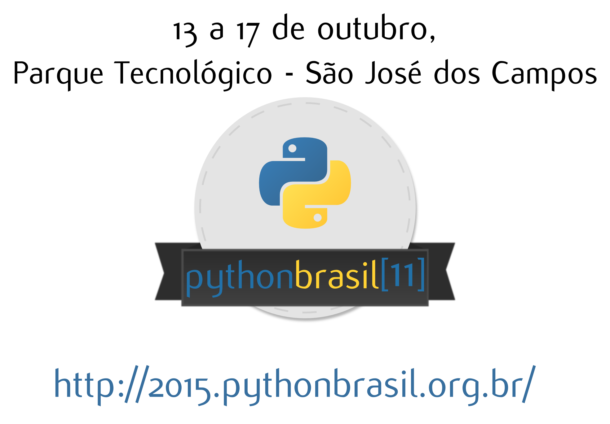

Imagens foram otimizadas utilizando o https://kraken.io/web-interface no modo "LOSSLESS"

As originais encontram-se na pasta originais

As imagens foram geradas apartir do arquivo:  https://github.com/pythonbrasil/pythonbrasil11/identidade-visual/pythonbrasil11.svg
Instale as fontes contidas na pasta `fonts` para poder visualizar corretamente o arquivo no Inkscape

##### I'm Attending Python Brasil 11 -  326x326px 495DPI:

##### Eu vou na Python Brasil 11 -  326x326px 495DPI:

##### I speak at Python Brasil 11 -  326x326px 495DPI:

##### Eu vou palestrar na Python Brasil 11 -  326x326px 495DPI:

##### Slide fundo transparente Python Brasil 11 -  326x326px 495DPI:

##### Há imagens com maior resolução, verifique os arquivos com nomes terminados em `_1628x1628_px_495DPI.png`